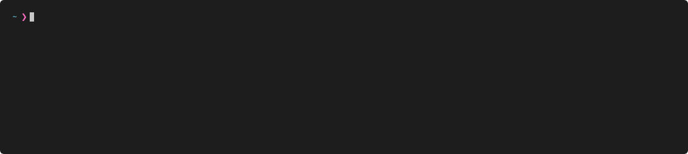

# bonfire <!-- omit in toc -->

A CLI tool used by Red Hat engineers to deploy console.redhat.com applications into kubernetes/OpenShift. This tool is mainly used for the purpose of creating ephemeral test environments.

As an example, typing `bonfire deploy host-inventory` leads to the host-inventory application and all its dependencies being deployed and ready to run in under 4 minutes:




# Table of Contents <!-- omit in toc -->

- [About](#about)
- [Installation](#installation)
- [Quick Start](#quick-start)
  - [Deploying](#deploying)
  - [Namespace Management](#namespace-management)
  - [Namespace Context](#namespace-context)
- [Examples for Common Use Cases](#examples-for-common-use-cases)
- [Commonly Used CLI Options](#commonly-used-cli-options)
  - [Deploying/Processing](#deployingprocessing)
- [Interactions with Ephemeral Namespace Operator](#interactions-with-ephemeral-namespace-operator)
- [Interactions with Clowder Operator](#interactions-with-clowder-operator)
  - [ClowdEnvironments](#clowdenvironments)
  - [Dependency Processing](#dependency-processing)
- [Configuration Details](#configuration-details)
  - [Using a local config](#using-a-local-config)
  - [Local config examples](#local-config-examples)
    - [Deploying local repo changes](#deploying-local-repo-changes)
    - [Deploying changes changes in a remote git branch](#deploying-changes-changes-in-a-remote-git-branch)
  - [Advanced](#advanced)
    - [Running a local qontract-server](#running-a-local-qontract-server)

# About

`bonfire` interacts with a running instance of [qontract-server](https://github.com/app-sre/qontract-server) (the component that powers the [AppSRE team](https://github.com/app-sre/)'s internal `app-interface` graphql API) to obtain applications' OpenShift templates, process them, and deploy them. A local configuration file can be defined that allows you to override an application config if you wish.

It also interacts with the [ephemeral namespace operator](https://github.com/RedHatInsights/ephemeral-namespace-operator) to manage the reservation of ephemeral namespaces for testing.

It has special functionality related to the [Clowder operator](https://github.com/RedHatInsights/clowder) and [Frontend operator](https://github.com/RedHatInsights/frontend-operator/) such as auto-deploying ClowdApp dependencies.

A wide range of CLI options allow you to customize exactly what combination of components get deployed into a namespace.

> NOTE: for information related to app-interface configurations, see the internal [ConsoleDot Docs](https://consoledot.pages.redhat.com/)

# Installation

We'd recommend setting up a virtual environment for bonfire:

```bash
VENV_DIR=~/bonfire_venv
mkdir -p $VENV_DIR
python3 -m venv $VENV_DIR
. $VENV_DIR/bin/activate
pip install crc-bonfire
```

To prevent GitHub rate limiting issues when bonfire reaches out to GitHub APIs, [create a personal access token](https://docs.github.com/en/authentication/keeping-your-account-and-data-secure/creating-a-personal-access-token) on your GitHub account which grants bonfire read access to your repos. Configure bonfire to use the token with:
```
echo 'GITHUB_TOKEN=<your api token>' >> ~/.config/bonfire/env
```


# Quick Start

Start with `bonfire --help` to familiarize yourself with the basic command groups. Don't forget to use the `--help` flag on sub-commmands as well if you are curious to learn more about different CLI commands, options, and arguments.

## Deploying

The command you are most likely to use is `bonfire deploy`.

If you are on the Red Hat VPN, `bonfire` will communicate with an internal instance of the App-SRE team's `qontract-server` API. You need to use `oc login` to log in to the ephemeral cluster.

Once logged in, you should be able to type `bonfire deploy advisor`

This will cause `bonfire` to do the following:
1. reserve a namespace
2. fetch the templates for all components in the 'advisor' app and process them. By default, bonfire will look up the template and commit hash using the 'main'/'master' branch of each component defined in the app. It will look up the git commit hash for this branch and automatically set the `IMAGE_TAG` parameter passed to the templates. 
3. if ClowdApp resources are found, figure out which additional ClowdApps to fetch and process
4. apply all the processed template resources into your reserved namespace
5. wait for all the resources to reach a 'ready' state

Run `bonfire namespace list --mine` and you will see your namespace.

Switch into that namespace with `oc project <NAMESPACE>`

Run `oc get clowdapp` in your namespace and you should see several ClowdApps have been deployed.

If you want to to extend the time you have to work with your namespace, use `bonfire namespace extend <NAMESPACE>`

When you are done working with your namespace, type `bonfire namespace release <NAMESPACE>` to instruct the ephemeral namespace operator to delete your reservation.

The deploy command is an 'all-in-one' command that ties together 4 steps:
1. `bonfire namespace reserve` to reserve a namespace
2. `bonfire process` to fetch and process app templates
3. `oc apply` to apply the processed app templates into the namespace
4. `bonfire namespace wait-on-resources <NAMESPACE>` to wait on all resources in the namespace to reach 'ready' state

## Namespace Management

* Reserve a namespace with: `bonfire namespace reserve`
    * By default, the duration is 1 hour. Increase it with `-d/--duration <time>` -- example time format: `48h`
    * Different namespace pools are set up to provide different test environment configurations. Use `--pool <pool>` if you need to select a non-default pool. To get a list of valid pools, use `bonfire pool list`
* Look up namespaces with: `bonfire namespace list`
    * use `--mine` to see only ones reserved in your name
* Extend your reservation with: `bonfire namespace extend <NAMESPACE> -d <time>` -- example time format: `48h`
* Release your namespace reservation with: `bonfire namespace release <NAMESPACE>`

## Namespace Context

As of v4.12.0, `bonfire` now analyzes the namespace set in your oc/kubectl context. This means you can run commands such as `namespace extend`, `namespace release`, or `deploy` after you have switched into a namespace using `oc project` and you no longer need to specify the namespace on the CLI. `bonfire` will attempt to use your current namespace (it will run checks to ensure that you own it first and warn if you do not). In addition, when a new namespace is reserved using `bonfire deploy` or `bonfire namespace reserve`, bonfire will also go ahead and run `oc project <NAMESPACE>` for you to switch your context into that new namespace.

The `deploy` command can be run using the `--reserve` flag if you wish to ignore the current namespace and force a namespace reservation to occur.

The automatic 'oc' context switching into a newly reserved namespace is disabled when bonfire is operating in "bot" mode (i.e. when the env var `BONFIRE_BOT` is set to `true`). When using bonfire in an automated CI/CD environment such as Jenkins, you should run in bot mode to disable automatic context switching.

# Examples for Common Use Cases

In these examples, we will use the 'advisor' app which has a ClowdApp component named 'advisor-backend'

* Deploy advisor-backend using a custom git branch:
```
bonfire deploy advisor --set-template-ref advisor-backend=custom_branch
```

* Deploy advisor-backend using a custom git commit:
```
bonfire deploy advisor --set-template-ref advisor-backend=df0d7a620b1ac02e59c5718eb22fe82b8a4cfd3d
```

* Use a certain branch to process the advisor-backend template, but set a different image tag on the container:
```
bonfire deploy advisor --set-template-ref advisor-backend=some_branch --set-parameter advisor-backend/IMAGE_TAG=some_tag
```

* Deploy the production version of advisor and its dependencies:
```
bonfire deploy advisor --ref-env insights-production
```

* Deploy the production version of everything but use a dev branch for advisor-backend:
```
bonfire deploy advisor --ref-env insights-production --set-template-ref advisor-backend=dev_branch
```

* Adjust the 'REPLICAS' parameter value at deploy time:
```
bonfire deploy advisor --set-parameter advisor-backend/REPLICAS=3
```

* Override the tag for all occurences of a specific container image:
```
bonfire deploy advisor --set-image-tag quay.io/cloudservices/advisor-backend=my_tag
```

# Commonly Used CLI Options
## Deploying/Processing

* `--frontends=true` -- by default, bonfire will not deploy Frontend resources. Use this flag to enable the deployment of app frontends.
* `--set-image-tag <image uri>=<tag>` -- use this to change the image tag of a container image that appears in your templates. This does a search/replace for all occurences of `<image uri>` and sets the tag to be `<tag>`
* `--target-env` -- this changes which deploy target `bonfire` looks up to determine the parameters to apply when processing app templates. By default, the target env is set to `insights-ephemeral`
* `--ref-env` -- this changes which deploy target `bonfire` looks up to determine the git ref to fetch for your app configuration. For example, using `--ref-env insights-stage` would cause bonfire to deploy the stage git ref of your app and `--ref-env insights-production` would cause bonfire to deploy the production git ref of your app. If a target matching the environment is not found, `bonfire` defaults back to deploying the 'main'/'master' branch.
* `--set-template-ref <component>=<ref>` -- use this to change the git ref deployed for just a single component.
* `--set-parameter <component>/<name>=<value>` -- use this to set a parameter value on a specific component's template.
* `--optional-deps-method <hybrid|all|none>` -- change the way that bonfire processes ClowdApp optional dependencies (see "Dependency Processing" section)


# Interactions with Ephemeral Namespace Operator

`bonfire` creates/modifies `NamespaceReservation` resources on the cluster to reserve and release namespaces. The template for the object that bonfire applies into the cluster can be found [here](bonfire/resources/reservation-template.yaml)

For more information about how the ephemeral namespace operator works, see its documentation [here](https://github.com/RedHatInsights/ephemeral-namespace-operator)

# Interactions with Clowder Operator

## ClowdEnvironments

* `bonfire` expects a Clowder `ClowdEnvironment` resource to be created for a namespace before it can deploy into it. This `ClowdEnvironment` is already created by the ephemeral namespace operator.

* When `bonfire deploy` is executed for a namespace, it will attempt to find the ClowdEnvironment associated with that namespace and set the `ENV_NAME` parameter accordingly for all templates it processes. All templates that define a `ClowdApp` resource should set the `environment` mapping in their spec using a parameter named `${ENV_NAME}`.

## Dependency Processing

In a ClowdApp definition, an app listed under `dependencies` is considered an app that MUST be present for your app to function, while an app listed under `optionalDependencies` is considered an app that might be absent, but your app could still come up and function without it.

When bonfire processes templates, if it finds a ClowdApp, it will do the following:
* if the ClowdApp has `dependencies`, it will try to look up the config for that ClowdApp in app-interface and also fetch its templates
* if the ClowdApp has `optionalDependencies`, it will behave differently based on which optional dependencies method is selected:

  * `hybrid` (default): if an app group was explicitly specified on the CLI (example: when running `bonfire deploy app-a` the app group 'app-a' is being explicitly specified) then the `optionalDependencies` will be deployed for it. For any ClowdApp `bonfire` comes across that is not a member of an explicitly specified app group, the `optionalDependencies` will NOT be deployed. As an example:
    * `app-a` has `app-b-clowdapp` listed under `optionalDependencies`
    * `app-b-clowdapp` has `app-c-clowdapp` listed under its `optionalDependencies`
    * You will end up with all components of `app-a` and `app-b-clowdapp` in your namespace. `app-c-clowdapp` would NOT be deployed into the namespace.
  * `all`: `bonfire` will deploy all `optionalDependencies` for all ClowdApps it encounters. It will recursively process dependencies. As an example:
    * `app-a` has `app-b-clowdapp` listed under `optionalDependencies`
    * `app-b-clowdapp` has `app-c-clowdapp` listed under its `optionalDependencies`
    * You will end up with all components of `app-a`, `app-b-clowdapp`, AND `app-c-clowdapp` deployed into the namespace.
  * `none`: `bonfire` will ignore the `optionalDependencies` on all ClowdApps that it encounters

# Configuration Details 

> NOTE: for information related to app-interface configurations, see the internal [ConsoleDot Docs](https://consoledot.pages.redhat.com/)

When running `bonfire process`/`bonfire deploy`, by default the app-sre team's internal GraphQL API server is used. `bonfire` will query the GraphQL API and read the application's deploy configuration.

*NOTE*: You need to be on the internal VPN in order to access the default GraphQL API URL.

`bonfire` relies on a few key pieces of info to process app configs:

1. The application name. This is typically the name of the listed in `app.yaml` in `app-interface`
2. A 'target env' -- the name of the `app-interface` environment that bonfire looks at to determine the parameters to apply when processing app templates. An app's config will only be processed if it has a deploy target set up that is pointing to a namespace in this environment (default: "ephemeral")
3. A 'ref env' -- the name of the `app-interface` environment that we want to use in order to figure out which git ref of the components to deploy and which `IMAGE_TAG` value to set. By default, none is set which causes bonfire to use the 'main'/'master' git branch for all components.
4. Any template refs you wish to override (optional)
5. Any image tags you wish to override (optional)
6. Any parameters you wish to override (optional)

By default, if app components use `ClowdApp` resources in their templates, then `bonfire` will dynamically load dependencies (see "Dependency Processing" section)

## Using a local config

`bonfire` ships with a [default config](bonfire/resources/default_config.yaml) that should be enough to get started for most internal Red Hat employees.

By default, the configuration file will be stored in `~/.config/bonfire/config.yaml`. 

If you wish to override any app configurations, you can edit your local configuration file by typing `bonfire config edit`. You can then define an app under the `apps` key of the config. You can reset the config to default at any time using `bonfire config write-default`.

As of `bonfire` v5, there are two options for how the local configuration is loaded (controlled by the `--local-config-method` CLI option). Let's say we have an app configured in app-interface like this:

```
resourceTemplates:
- name: mycomponent1
  path: /deployment.yaml
  url: https://github.com/myorg/myrepo1
  targets:
  - namespace:
      $ref: /services/insights/ephemeral/namespaces/ephemeral-base.yml
    parameters:
      MIN_REPLICAS: 1
- name: mycomponent2
  path: /deployment.yaml
  url: https://github.com/myorg/myrepo2
  targets:
  - namespace:
      $ref: /services/insights/ephemeral/namespaces/ephemeral-base.yml
    parameters:
      MIN_REPLICAS: 2
      SOME_OTHER_PARAM: some_other_value
```

and the local config file has this entry:

```
apps:
- name: myapp
  components:
  - name: mycomponent2
    parameters:
      MIN_REPLICAS: 10
```

`bonfire` can override the remote configuration using one of two methods:

1. `--local-config-method merge` (default). In this mode, the apps config in your local config is merged with the configuration that bonfire fetched remotely. With the above config, only the 'MIN_REPLICAS' parameter of 'mycomponent2' within app 'myapp' will be overridden. The 'SOME_OTHER_PARAM' parameter will still be present, and 'mycomponent1' would be unchanged.

2. `--local-config-method override`. In this mode, the local app configuration will take precedence over the app's configuration that bonfire fetched remotely. In other words, defining a local app configuration will replace the configuration defined in app-interface for ALL components within that app. So 'mycomponent1' would be completely removed, and 'mycomponent2' would only have the parameters you defined in the local config.

## Local config examples

### Deploying local repo changes

If you wanted to test out some changes you're making to an app but you have not yet pushed these changes to a git repo, the local config could look similar to:

```
apps:
- name: my_app
  components:
    - name: service
      host: local
      repo: ~/dev/projects/my-app
      path: /clowdapp.yaml
      parameters:
        SOME_PARAMETER: some_value
```

- Where **host** set `local` indicates to look for the repo in a local directory
- Where **repo** indicates the path to your git repo folder
- Where **path** specifies the relative path to your ClowdApp template file in your git repo

By default, `bonfire` will run `git rev-parse` to determine the current working commit hash in your repo folder, and this determines what IMAGE_TAG to set when the template is deployed. This means you would need to have a valid container image pushed for this commit hash. However, you can use `--set-image-tag`/`--set-parameter` or define the `IMAGE_TAG` parameter in your config in order to override the image you wish to use during the deployment.

### Deploying changes changes in a remote git branch

If you wanted to deploy changes to your app that you were working on which have been pushed to a PR/branch, the local config could look similar to:

```
apps:
- name: my_app
  components:
    - name: service
      host: github
      repo: MyOrg/MyRepo
      ref: my_branch
      path: /clowdapp.yaml
```

- Where **host** set to `github` or `gitlab` indicates where the repo is hosted
- Where **repo** indicates the `OrganizationName/RepoName`
- Where **path** specifies the relative path to your ClowdApp template file in your git repo
- Where **ref** specifies the branch or commit of the repo you want to deploy

By default, bonfire will use the latest commit hash found at the specified git ref to determine what IMAGE_TAG pass on to the deployment templates.

## Advanced
### Running a local qontract-server

bonfire is configured to point to the app-sre team's internal GraphQL API by default, but by using env variables you can point to your your own instance of `qontract-server`:

```bash
export QONTRACT_BASE_URL="https://localhost:4000/graphql"
export QONTRACT_USERNAME=myUsername
export QONTRACT_PASSWORD=myPassword
```

For testing/debug purposes, instead of committing changes directly to app-interface, you can run your own local copy of the app-interface API server.

1. Clone https://github.com/app-sre/qontract-server
2. Clone the internal `app-interface` repo

In `qontract-server`, run:
```
npm install yarn
yarn install
yarn build
make bundle APP_INTERFACE_PATH=/path/to/app-interface
LOAD_METHOD=fs DATAFILES_FILE=bundle/bundle.json yarn run server
```
